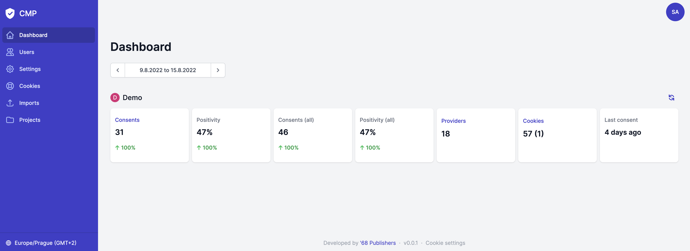

<div align="center" style="text-align: center; margin-bottom: 50px">

<h1 align="center">Consent Management Platform</h1>

🛡 Easily manage user consents and the cookie widget.
</div>

<br>

## Table of Contents
* [About CMP](#about-cmp)
* [Getting Started](#getting-started)
  * [Prerequisites](#prerequisites)
  * [Installation](#installation)
* [Product Documentation](#product-documentation)
* [Development Guide](#development-guide)

## About CMP

The CMP is a standalone application for storing users' cookie consent and managing the cookies themselves on any website or application.



## Getting Started

### Prerequisites
- Docker
- Make

### Installation
```sh
$ git clone https://github.com/68publishers/consent-management-platform cmp
$ cd cmp
$ cp .env.dist .env
$ make init
```

Visit http://localhost:8888 and sign in via `admin@68publishers.io` / `admin` credentials.

See [Makefile](./Makefile) for other useful commands and the [Development Guide](docs/development.md) for information about ENV variables etc.

## Product Documentation

For documentation of the application from a user perspective, please go to the [Product Documentation](docs/product.md).

## Development Guide

For more technical information, please go to the [Development Guide](docs/development.md).
