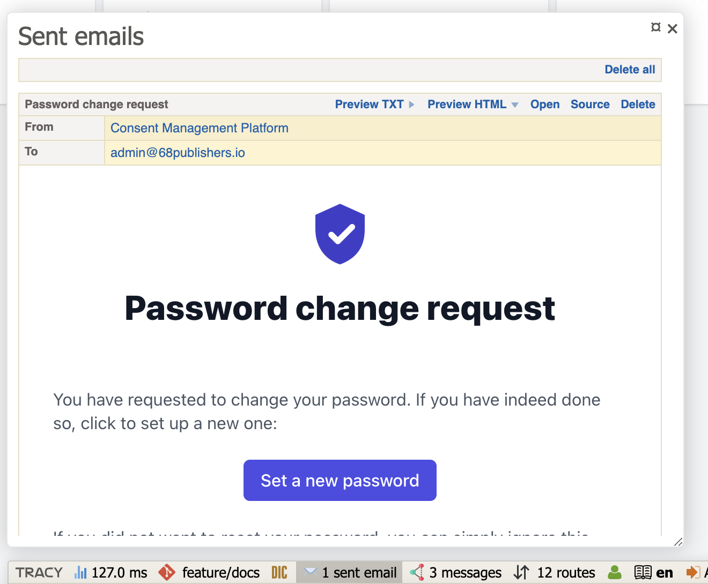

<div align="center" style="text-align: center; margin-bottom: 50px">

<h1 align="center">Development Guide</h1>
</div>

<br>

## Table of Contents
* [Stack](#stack)
* [ENV variables](#env-variables)
* [Frontend](#frontend)
* [Fixtures](#fixtures)
* [Sending emails](#sending-emails)
* [Console commands](#console-commands)
* [API and integration](#api-and-integration)
* [Cookies crawler](#cookies-crawler)
* [How to update to the latest version](#how-to-update-to-the-latest-version)
* [Production build](#production-build)
* [Contributing](#contributing)

## Stack

The application runs in Docker and consists of the following [services](../docker-compose.yml):

- App (`cmp-app`) - Nginx webserver with PHP `8.3`, composer and yarn
- Worker (`cmp-worker`) - PHP `8.3` cli with supervisor
- Db (`cmp-db`) - PostgreSQL in the version `13.6`
- Redis (`cmp-redis`) - Redis in the version `7.0.10`

You can connect to each of the containers using the following command.

```sh
$ docker exec -it <CONTAINER_NAME> sh 
```

## ENV Variables

The application requires several ENV variables to be set.
The [.env.dist](../.env.dist) file contains ENVs for local development. Consider production configuration depending on your needs.

| Variable name               | Type               | Required                        | Default                       | Additional info                                                                                                                                                                       |
|-----------------------------|--------------------|---------------------------------|-------------------------------|---------------------------------------------------------------------------------------------------------------------------------------------------------------------------------------|
| APP_DEBUG                   | Boolean            | no                              | `1`                           | Forces debug mode.                                                                                                                                                                    |
| APP_DEBUG_COOKIE_SECRET     | String             | no                              | `hey_tracy`                   | The debug mode can be enabled with a cookie. A key is `debug_please` and a value is equal to the ENV variable.                                                                        |
| PROJECT_URL                 | String             | yes                             | `https://cmp.local`           | Full URL to the document root of the application.                                                                                                                                     |
| TRUSTED_PROXIES             | CommaSeparatedList | no                              | -                             | The list of IP addresses (or ranges like 1.0.0.0/1) separated by a comma. Setup the variable if the site is running behind an HTTP proxy.                                             |
| COOKIE_SECURE               | Boolean            | no                              | `1`                           | Send cookies only via HTTP or HTTPS. It is detected automatically from a request protocol if the variable is not set.                                                                 |
| API_DOCS_ENABLED            | Boolean            | no                              | `1`                           | Enables OpenApi schema and Swagger UI endpoints.                                                                                                                                      |
| GTM_CONTAINER_ID            | String             | no                              | -                             | Enables GTM. GTM will be initialized only if the variable exists and the value is not empty.                                                                                          |
| CONSENT_GRID_ESTIMATE_ONLY  | Boolean            | no                              | `0`                           | If the application has a large number of consents, it is recommended to enable this option for performance reasons. The list of consents will then have only a simplified pagination. |
| DB_HOST                     | String             | yes                             | `db`                          | -                                                                                                                                                                                     |
| DB_PORT                     | Integer            | yes                             | `5432`                        | -                                                                                                                                                                                     |
| DB_NAME                     | String             | yes                             | `cmp`                         | -                                                                                                                                                                                     |
| DB_USER                     | String             | yes                             | `root`                        | -                                                                                                                                                                                     |
| DB_PASSWORD                 | String             | yes                             | `root`                        | -                                                                                                                                                                                     |
| REDIS_HOST                  | String             | yes                             | `redis`                       | -                                                                                                                                                                                     |
| REDIS_PORT                  | Integer            | yes                             | `6379`                        | -                                                                                                                                                                                     |
| REDIS_AUTH                  | String             | no                              | `redis_pass`                  | Set only if Redis has a password.                                                                                                                                                     |
| REDIS_DB_CACHE              | Integer            | no                              | `0`                           | Redis database number for caching.                                                                                                                                                    |
| REDIS_DB_SESSIONS           | Integer            | no                              | `1`                           | Redis database number for sessions.                                                                                                                                                   |
| MAILER_EMAIL                | String             | yes                             | `noreply@example.com`         | Email address for sending emails.                                                                                                                                                     |
| MAILER_FROM                 | String             | no                              | `Consent Management Platform` | Name of email address for sending emails.                                                                                                                                             |
| SMTP_ENABLED                | Boolean            | no                              | `1`                           | Required in production environment only. Enables sending emails using SMTP.                                                                                                           |
| SMTP_HOST                   | String             | no                              | `mailer`                      | Required only if `SMTP_ENABLED=1`.                                                                                                                                                    |
| SMTP_PORT                   | Integer            | no                              | `1025`                        | Required only if `SMTP_ENABLED=1`.                                                                                                                                                    |
| SMTP_USERNAME               | String             | no                              | -                             | -                                                                                                                                                                                     |
| SMTP_PASSWORD               | String             | no                              | -                             | -                                                                                                                                                                                     |
| SMTP_SECURE                 | String             | no                              | -                             | Required only if `SMTP_ENABLED=1`. Allowed values are `ssl` or `tls`.                                                                                                                 |
| RECAPTCHA_ENABLED           | Boolean            | no                              | `0`                           | Enables reCAPTCHA in the application (on the forgot password page).                                                                                                                   |
| GOOGLE_RECAPTCHA_SITE_KEY   | String             | no                              | -                             | The site key for Google reCAPTCHA v3                                                                                                                                                  |
| GOOGLE_RECAPTCHA_SECRET_KEY | String             | no                              | -                             | The secret key for Google reCAPTCHA v3                                                                                                                                                |
| SENTRY_DSN                  | String             | no                              | -                             | DSN of the Sentry project for capturing application errors.                                                                                                                           |
| NGINX_DOMAIN_NAME           | String             | yes (for local environment)     | `cmp.local`                   |                                                                                                                                                                                       |
| NGINX_RESTRICT_ACCESS       | Boolean            | yes (for local environment)     | `0`                           |                                                                                                                                                                                       |
| CERTBOT_EMAIL               | String             | yes (for dev environment)       | `info@example.com`            |                                                                                                                                                                                       |
| COMPOSE_ENV                 | String             | yes (for local/dev environment) | `local`                       | "local" or "stage"                                                                                                                                                                    |

## Frontend

As far as the visual side is concerned, the application is based mainly on Tailwind CSS and Alpine.js components.
The final build is created using Webpack Encore and PostCSS.

You can rebuild the assets with following command:

```sh
$ make install-assets
```

## Fixtures

The default demo data is automatically imported when the application is [installed](../README.md#installation).
To reset the data, run the following command:

```sh
$ make data
```

:exclamation: Do not run the fixtures on production!

## Sending emails

By default, emails are sent using the PHP function `mail()`. However, the `sendmail` extension is not installed in the container and therefore emails are not sent.
For this reason, you need to configure the SMPT server through the ENV variables.
For example, Google's SMTP server configuration would look something like this:

```sh
SMTP_ENABLED=1
SMTP_HOST=smtp.gmail.com
SMTP_PORT=465
SMTP_USERNAME=your email address
SMTP_PASSWORD=your token
SMTP_SECURE=ssl
```

If the debug mode is enabled (`APP_DEBUG=1` or the user has set the `APP_DEBUG_COOKIE_SECRET` cookie in the browser), the emails are always saved to local files and can be viewed in the Tracy Bar.



## Console commands

The application contains several commands. Some of them should be set to CRONTAB for periodical execution.

### Weekly overview

The command sends a weekly report with project statistics to users who have this notification enabled.
Users will only receive statistics for the projects they have access to.

```sh
$ bin/console cmp:weekly-overview
```

In CRONTAB, schedule the command to run once a week, e.g. every Monday at 4:00 a.m.

### Consent decrease notification

The command sends a notification of the previous day's consent decrease for all projects to users who have this notification enabled.
Users will only receive information for the projects they have access to.

```sh
$ bin/console cmp:consent-decrease-notifier
```

In CRONTAB, schedule the command to run once a day, e.g. every day at 4:00 a.m.

### Cookie suggestions notification

If the application has configured a connection to the [crawler](#cookies-crawler), it is possible to send notifications about new cookie suggestions.

The command sends a notification with new cookie suggestions to users who have this notification enabled.
Users will only receive suggestions for the projects they have access to.

```sh
$ bin/console cmp:cookie-suggestions-notifier
```

In CRONTAB, schedule the command to as you see fit. For example, once a week.

### Monthly statistics

The command is designed to be run manually. The output is the number of consents per month in the selected year.
The command has the following options:

- `--accepted-all` - Calculates number of users who have agreed to all categories of cookies.
- `--rejected-all` - Calculates the number of users who did not accept any cookie category.
- `--by-categories` - Calculates the number of users who have agreed to given categories. Use the category codes separated by a comma as the value.
- `--unique` - Count only unique (last) consents by user in a particular month.
- `--year` - Year for which statistics are to be calculated. Current year is used if the option is not provided.
- `--format` - Output format. Allowed values are `table` (default) and `csv`.

Here are some examples:

```sh
# Calculate number of users who have agreed to all categories of cookies:
$ bin/console cmp:monthly-statistics <project-code> --accepted-all

# Calculate the number of users who did not accept any cookie category:
$ bin/console cmp:monthly-statistics <project-code> --rejected-all

# Calculate the number of users who have agreed with categories `ad_storage` and `analytics_storage`:
$ bin/console cmp:monthly-statistics <project-code> --by-categories "ad_storage,analytics_storage"

# Calculate the number of users who have agreed with the category `ad_storage` but rejected the category `analytics_storage`:
$ bin/console cmp:monthly-statistics <project-code> --by-categories "ad_storage,!analytics_storage"

# The requested statistics can be returned in single runtime:
$ bin/console cmp:monthly-statistics <project-code> --accepted-all --rejected-all --by-categories "ad_storage,analytics_storage" --by-categories "ad_storage,!analytics_storage"
```

## API and integration

The application exposes the API to communicate with the cookie widget.

All endpoints are described using OpenApi. To display the Swagger UI, set the ENV variable `API_DOCS_ENABLED` to `1` and open the page https://cmp.local/api/docs in your browser.

If your website using [68publishers/cookie-consent](https://github.com/68publishers/cookie-consent), there is no need to manually integrate or call anything. Everything is ready, and it is only necessary to configure the GTM tag correctly.
More information about the integration can be found in the [documentation](https://github.com/68publishers/cookie-consent#integration-with-cmp-application) of the `68publishers/cookie-consent` package.

## Cookies crawler

The application offers the possibility to connect with a cookie crawler.
If you wish to use the crawler in the CMP application, it is necessary to have a running instance of the [68publishers/crawler](https://github.com/68publishers/crawler) application.

It should be noted that the crawler is relatively heavy on resources if it has to deal with difficult scenarios.

The scenarios themselves are defined through the user interface of the CMP application, but defining them is rather a developer's job and requires knowledge of the mentioned crawler.

## How to update to the latest version

:exclamation: When updating, please always read the notes on newly released versions carefully!

Usually there are several things to do, such as:

- run composer install
- run yarn install
- run webpack encore
- run database migrations
- clear cache
- restart worker
- ...

All of these tasks can be done after downloading the new version by running the following commands:

```sh
$ make install
$ make restart
```

## Production build

For production usage, there are prepared docker images on the [DockerHub](https://hub.docker.com/r/68publishers/cmp/tags).

Two images are published with each new version of the application:

- `68publishers/cmp:app-{version}` - the container with the application
- `68publishers/cmp:worker-{version}` - the container with the worker

The images are already build, they contain all libraries, assets and so on. So there should be no need to manually install or build anything into them.

## Contributing

If you find any problems or have a specific question, please create an issue on GitHub. We will address it as soon as possible.
Please try to describe the issue as best you can (under what circumstances the issue arises, error messages, etc.).

If you want to contribute to the code (ideally after the previous discussion in an issue), create a fork of the repository with its own branch and then create a pull request with it.

Follow the uniform coding standards and coding style.

Before committing and creating a pull request, run the following command:

```sh
$ make cs
```
