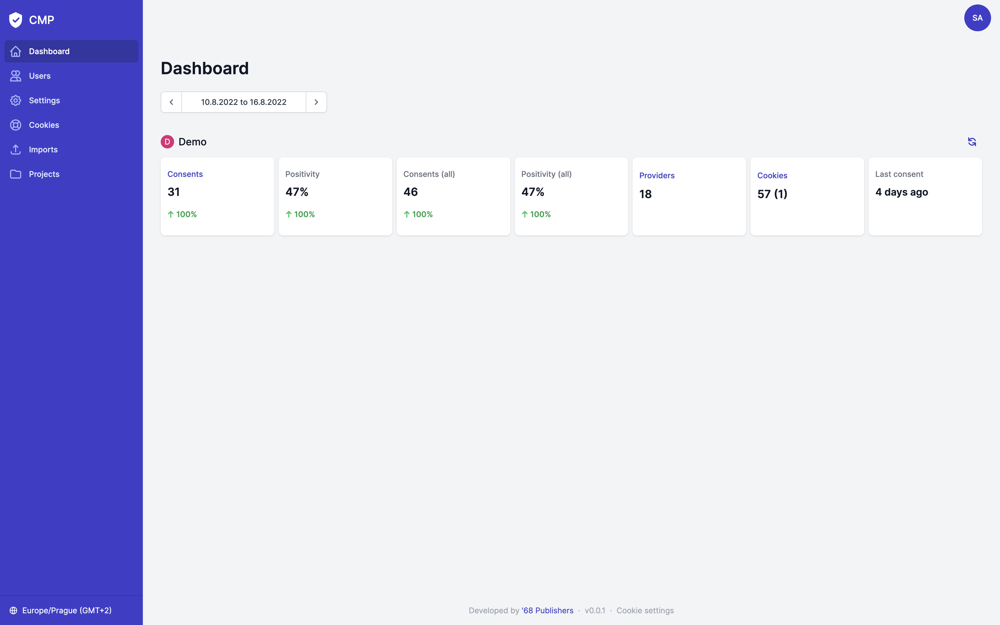
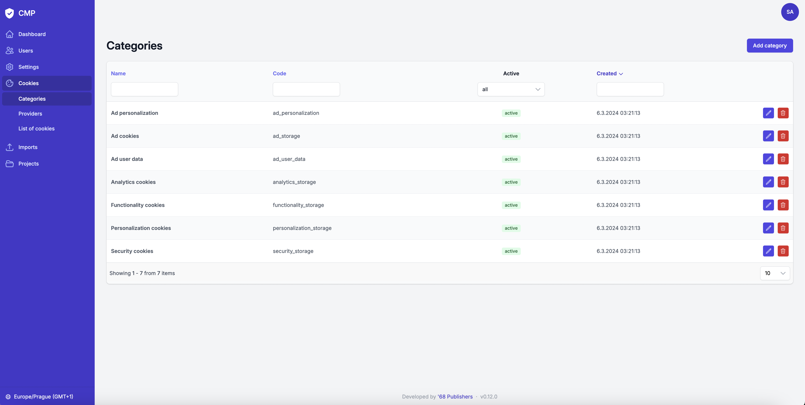

<div align="center" style="text-align: center; margin-bottom: 50px">

<h1 align="center">Product Documentation</h1>
</div>

<br>

## Table of Contents
* [Dashboard](#dashboard)
* [Users](#users)
* [Settings](#settings)
  * [Localization](#localization)
  * [Environments](#environments)
  * [Performance](#performance)
  * [Crawler](#crawler)
  * [Authentication with Azure AD](#authentication-with-azure-ad)
* [Cookies](#cookies)
  * [Categories](#categories)
  * [Providers](#providers)
  * [List of cookies](#list-of-cookies)
* [Crawler](#crawler-1)
  * [Scenario scheduling](#scenario-scheduling)
  * [Running scenarios](#running-scenarios)
* [Imports](#imports)
* [Projects](#projects)
  * [Consents](#consents)
  * [Cookie widgets](#cookie-widgets)
  * [Cookies > Providers](#cookies--providers)
  * [Cookies > Project cookies](#cookies--project-cookies)
  * [Cookies > Service cookies](#cookies--service-cookies)
  * [Integration](#integration)

## Dashboard

The Dashboard contains statistics for all projects available to the logged user.
For each project, the following statistics are calculated for the selected period:

| Type             | Description                                                                                                                                 |
|------------------|---------------------------------------------------------------------------------------------------------------------------------------------|
| Consents         | The number of unique consents (regardless of the positivity of the consent).                                                                |
| Positivity       | The percentage of unique consents that are positive (not counting necessary categories).                                                    |
| Consents (all)   | Total number of consents.                                                                                                                   |
| Positivity (all) | The percentage positivity of all consents (not including necessary categories).                                                             |
| Providers        | The number of cookie providers.                                                                                                             |
| Cookies          | The number of cookies. The first number are cookies bound to providers, the number in brackets are cookies defined directly on the project. |
| Last consent     | Shows when the last consent was given (either positive or negative).                                                                        |



## Users

Users are authenticated using an email and password, or by using [Azure Active Directory](#authentication-with-azure-ad).
Users cannot register themselves to the application, they must be added by an administrator.
The administrator can set a default password directly when creating a new user, or leave it blank and the user can choose own password using the "forgot password" functionality.
In addition, each user has assigned their projects that they can see and manage.

The application provides only two roles - `admin` and `manager` with following privileges:

| Resource/Action                                                   |      Manager       |       Admin        |
|-------------------------------------------------------------------|:------------------:|:------------------:|
| `Dashboard`                                                       |      Manager       |       Admin        |
| View statistics for projects that are visible to the current user | :white_check_mark: | :white_check_mark: |
| `User account`                                                    |      Manager       |       Admin        |
| Edit own data, change password                                    | :white_check_mark: | :white_check_mark: |
| `Users > Users`                                                   |      Manager       |       Admin        |
| View the list of users                                            |                    | :white_check_mark: |
| Create or edit a user                                             |                    | :white_check_mark: |
| Delete a user                                                     |                    | :white_check_mark: |
| `Users > New password requests`                                   |      Manager       |       Admin        |
| View the list of new password requests                            |                    | :white_check_mark: |
| `Settings`                                                        |      Manager       |       Admin        |
| View and edit the application settings                            |                    | :white_check_mark: |
| `Cookies > Categories`                                            |      Manager       |       Admin        |
| View the list of categories                                       |                    | :white_check_mark: |
| Create or edit a category                                         |                    | :white_check_mark: |
| Delete a category                                                 |                    | :white_check_mark: |
| `Cookies > Providers`                                             |      Manager       |       Admin        |
| View the list of providers                                        |                    | :white_check_mark: |
| Create or edit a provider                                         |                    | :white_check_mark: |
| Delete a provider                                                 |                    | :white_check_mark: |
| `Cookies > List of cookies`                                       |      Manager       |       Admin        |
| View the list of cookies                                          |                    | :white_check_mark: |
| Create or edit a cookie                                           |                    | :white_check_mark: |
| Delete a cookie                                                   |                    | :white_check_mark: |
| `Cookies > Cookie suggestions`                                    |      Manager       |       Admin        |
| View the list of projects                                         |                    | :white_check_mark: |
| View the list of cookie suggestions per project                   |                    | :white_check_mark: |
| Resolve cookie suggestions                                        |                    | :white_check_mark: |
| `Crawler > Scenario scheduling`                                   |      Manager       |       Admin        |
| View the list of scenarios                                        |                    | :white_check_mark: |
| Create or edit a scenario                                         |                    | :white_check_mark: |
| `Crawler > Running scenarios`                                     |      Manager       |       Admin        |
| View the list and details of scenarios                            |                    | :white_check_mark: |
| `Imports`                                                         |      Manager       |       Admin        |
| View the list of executed imports                                 |                    | :white_check_mark: |
| Run an import                                                     |                    | :white_check_mark: |
| `Projects`                                                        |      Manager       |       Admin        |
| View the list of projects that are visible by the current user    | :white_check_mark: | :white_check_mark: |
| Create a project                                                  |                    | :white_check_mark: |
| `Project > Consents`                                              |      Manager       |       Admin        |
| View the list of consents                                         | :white_check_mark: | :white_check_mark: |
| `Project > Cookie widgets`                                        |      Manager       |       Admin        |
| View the list of cookie widgets                                   | :white_check_mark: | :white_check_mark: |
| `Project > Cookies > Providers`                                   |      Manager       |       Admin        |
| View and edit project providers                                   | :white_check_mark: | :white_check_mark: |
| `Project > Cookies > Project cookies`                             |      Manager       |       Admin        |
| View the list of project cookies                                  | :white_check_mark: | :white_check_mark: |
| Create or edit a project cookie                                   | :white_check_mark: | :white_check_mark: |
| Delete a project cookie                                           | :white_check_mark: | :white_check_mark: |
| `Project > Cookies > Service cookies`                             |      Manager       |       Admin        |
| View the list of service cookies                                  | :white_check_mark: | :white_check_mark: |
| `Project > Integration`                                           |      Manager       |       Admin        |
| View and edit cookie table templates                              |                    | :white_check_mark: |
| View a cookie table integration code                              | :white_check_mark: | :white_check_mark: |
| `Project > Edit project`                                          |      Manager       |       Admin        |
| View and edit a project                                           |                    | :white_check_mark: |
| Delete a project                                                  |                    | :white_check_mark: |


## Settings

### Localization

This section is used to set the languages that are used on the websites that are connected to the CMP.

The "Translation locales" field should contain a complete list of all languages.
The default language is used if any record lacks a translation for the requested language.


### Environments

The cookies widget can send consents in different environments if it is configured in this way. In order to separate these environments in the list of consents, statistics and other places, it is necessary to define all the environments that are used.

If the widget has no configured environments, just leave the `default` environment.


### Performance

When loading cookie lists (cookie tables) into the cookie widget, it is possible to optimize requesting the CMP API using this configuration.

For production use, it is recommended to enable the "HTTP Header ETag" and "HTTP Header Cache-Control" options and set the "HTTP Header Cache-Control: max-age" field to some meaningful value, such as `3600` (1 hour).


### Crawler

The application can be connected to the crawler API, which can be used to crawl the project's website and search for cookies.
For this purpose, there are scenarios that can be defined after successful connection of the crawler.

Found cookies are then sent to the CMP, where an evaluation is performed to see if these cookies exist in the CMP, if they are problematic (for example, they are used on the page even though the user did not agree to them), etc.


### Authentication with Azure AD

Users can be authenticated to the CMP application using Azure Active Directory.

To do this, it is required to create an enterprise application in Azure and create a secret code for it. The application ID and the secret code (and possibly the tenant ID) must be set in the CMP configuration afterward.
The value of the "Callback URI" field, on the other hand, must be set as the "Redirect URI" in the Azure enterprise application.
Next, the `admin` and `manager` roles need to be created in Azure for the enterprise application.


## Cookies

Cookie management is based on the fact that cookie categories and cookie providers are defined.
Each provider is assigned its own cookies and the providers are then assigned to individual projects.


### Categories

The same categories of cookies (storages) that are used on the project's website should be defined in the application. At least the codes should be the same.

Be sure to mark the necessary category with the "Necessary category" flag.

The default installation will automatically create categories that are [defined by Google](https://policies.google.com/technologies/cookies?hl=en-US#types-of-cookies).



### Providers

A provider could be defined as a group of cookies.

For example, if the project website uses Google Analytics, there would be a provider in the CMP called "Google Analytics" that would have cookies related to that service.

### List of cookies

Although cookies are managed through individual providers, the list of all cookies can be found on this page.


### Cookie suggestions

This menu item will appear if the crawler is integrated into the application via [settings](#crawler).
There is the list of projects for which some crawler scenario has already been successfully run.
Each project also has its own detail, on which the cookie suggestions are located.

The suggestions are divided into several types:

- **New cookies**
  - Cookies that were found on the website but do not exist in the CMP
  - Cookies that were found on the website, exist in the CMP, but are not assigned to the current project.
- **Problematic cookies**
  - Cookies that were never found
  - Cookies that have not been found for a long time (more than 14 days).
  - Cookies that have been found on the website, but their category has not been agreed.
- **Unproblematic cookies** - Cookies for which no problem has been found.
- **Ignored cookies** - Cookie suggestions that have been temporarily or permanently marked as ignored.

## Crawler

This menu item will appear if the crawler is integrated into the application via [settings](#crawler).
The crawler is an external application that runs standalone. For more information follow the [Development Guide](./development.md#cookies-crawler).

### Scenario scheduling

To ensure that the crawler knows what pages to look for and how to behave on them, it needs to be provided with scenarios.
In addition, each scenario must be configured when to run (crontab syntax) and which cookie categories are allowed in the scenario. Problematic cookies are then evaluated according to these categories.

<details>
  <summary>Example scenario from the picture</summary>

```json
{
    "options": {
        "session": {
            "transferredCookies": [
                "cc-settings"
            ]
        },
        "viewport": {
            "width": 800,
            "height": 600
        },
        "maxRequests": 100,
        "maxConcurrency": 6,
        "maxRequestRetries": 2
    },
    "scenes": {
        "startup": [
            {
                "action": "runScene",
                "options": {
                    "scene": "acceptCookies"
                }
            },
            {
                "action": "collectCookies",
                "options": {}
            },
            {
                "action": "enqueueLinks",
                "options": {
                    "scene": "navigation",
                    "baseUrl": "{{location.origin}}",
                    "selector": "#navigation",
                    "strategy": "same-domain"
                }
            }
        ],
        "navigation": [
            {
                "action": "collectCookies",
                "options": {}
            },
            {
                "action": "enqueueLinks",
                "options": {
                    "scene": "navigation",
                    "selector": "#main",
                    "strategy": "same-domain"
                }
            }
        ],
        "acceptCookies": [
            {
                "action": "click",
                "options": {
                    "selector": "#c-p-bn"
                }
            },
            {
                "action": "delay",
                "options": {
                    "delay": 2000
                }
            }
        ]
    },
    "entrypoint": {
        "url": "https://www.example.com",
        "scene": "startup"
    }
}
```

The scenario setting says that we always transfer the `cc-settings` cookie between requests, regardless of the browser session.
It also specifies that a maximum of 100 pages will be crawled, at most 6 at a time, and if a page responds with an error code, the crawler will try to call the page twice more. The window size is set to `800x600` pixels.

The scenario then does the following:

- Opens the page https://www.example.com.
- Clicks on the button with ID `#c-p-bn` (Button to accept all cookies).
- Collects information about all cookies from the page.
- Finds links in the element `#navigation` and executes the scene `navigation` with them.
  - On each of these pages, cookies information is collected.
  - On each of these pages, it finds links in the element `#main` and starts the scene `navigation` with them again (recursion).

</details>
<br>


### Running scenarios

Here is the list of scenarios that are currently running or are already finished. By clicking on the detail it will display all the information about the scenario, what cookies it found, which pages it visited or screenshots it took.

There is also an option to manually run any scenario once.

## Imports

Providers and cookies can be managed externally in `CSV` or `JSON` format or, for example, in an application such as Microsoft Excel or Google Sheets.
Data in these formats can be imported into the application.

Here are examples of how the imported files should look like:

<details>
  <summary>Cookie providers import in CSV format</summary>

```csv
code|name|type|link|active|projects|purpose.cs|purpose.en
facebook_login|Facebook Login|3rd_party|https://www.facebook.com/about/privacy/|1|demo,test|"Platforma pro přihlášení skrze Facebook."|"Facebook login platform."
# ... more rows ...
```

</details>

<details>
  <summary>Cookie providers import in JSON format</summary>

```json5
[
  {
    "code": "facebook_login",
    "name": "Facebook login",
    "type": "3rd_party",
    "link": "https://www.facebook.com/about/privacy/",
    "active": true,
    "projects": [
      "demo",
      "test"
    ],
    "purpose": {
      "cs": "Platforma pro přihlášení skrze Facebook.",
      "en": "Facebook login platform."
    }
  }
  // ... more providers ...
]
```

</details>

- Allowed values for the field `type` are `1st_party` and `3rd_party`
- Projects in CSV must be comma separated list
- In CSV, each locale for `purpose` field must be separated column in the format `purpose.<LOCALE>`

<details>
  <summary>Cookies import in CSV format</summary>

```csv
name|domain|category|provider|processingTime|active|purpose.cs|purpose.en|environments
c_user|example.com|security_storage|facebook_login|session|1|"Facebook ID zákazníka."|"Customer\'s Facebook ID."|"mobile"
# ... more rows ...
```

</details>

<details>
  <summary>Cookies import in JSON format</summary>

```json5
[
  {
    "name": "c_user",
    "domain": "example.com",
    "category": "security_storage",
    "provider": "facebook_login",
    "processingTime": "session",
    "active": true,
    "purpose": {
      "cs": "Facebook ID zákazníka.",
      "en": "Customer\'s Facebook ID."
    },
    "environments": [
      "mobile"
    ]
  }
  // ... more cookies ...
]
```

</details>

- The field `domain` can be an empty string. In this case the project domain will be used when cookies are returned via CMP API.
- The field `category` must contain a category code
- The field `provider` must contain a provider code
- Allowed values for the field `processingTime` are `"session"`, `"persistent"` or a duration string
- The field `environments` must contain a list of environment codes. The code for the default environment is always `"default"`.
- In JSON, use en empty array for the field `environments` if the cookie are for all environments
- In CSV, use an empty value for the field `environments` if the cookie are for all environments. If the cookie is in multiple environments, use a comma separated list e.g. `default,mobile`.
- In CSV, each locale for `purpose` field must be separated column in the format `purpose.<LOCALE>`

For importing the main (1st party) provider, it is necessary that its project already exists. If the project doesn't exist, the provider will be created as a generic provider that can be assigned to any project.

So the correct procedure is to create projects first and then import the data.

## Projects

After selecting a specific project, the user is moved to the context of the selected project where he can see consents, cookie widget settings and manage project cookies.

### Consents

There is the list of all recorded consents.
The consents are grouped according to the user identifier that the cookie widget creates and sends. After clicking on the detail, the complete consent history of the user is displayed.


### Cookie widgets

On this page are listed the settings of all cookie widgets used on the project website.
The uniqueness of the cookie widget is determined by the checksum that is calculated and sent by the cookie widget itself.


### Cookies > Providers

This page allows to set the basic information about the main (1st party) provider and also to assign other providers respectively individual service providers to the project.

### Cookies > Project cookies

The main (1st party) provider cookies can be managed on this page. These cookies are related only to the current project.

### Cookies > Service cookies

On this page is the list of all cookies of providers that are associated with the current project. The list is readonly.

### Integration

By integration is meant the ability to easily render a table with providers, alternatively with cookies, directly on the project website. For example, through a static page.

A template that fits exactly into the design of the website can be defined for each locale. The table can be displayed by copying the generated script to the website.

The templates are written in the [Latte](https://latte.nette.org/) templating language and two variables can be accessed - `$providers` and `$cookies`. It is recommended leaving the creation of the templates to the developer.

Values of the provided variables exactly copy the response from the endpoint `/api/v{version}/cookies/{project}`. More information about the API in the [Development Guide](development.md).


