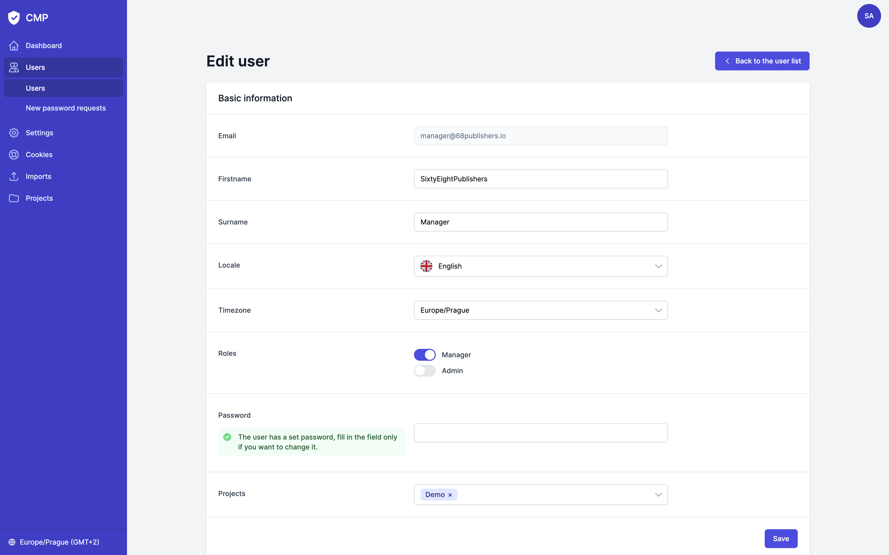
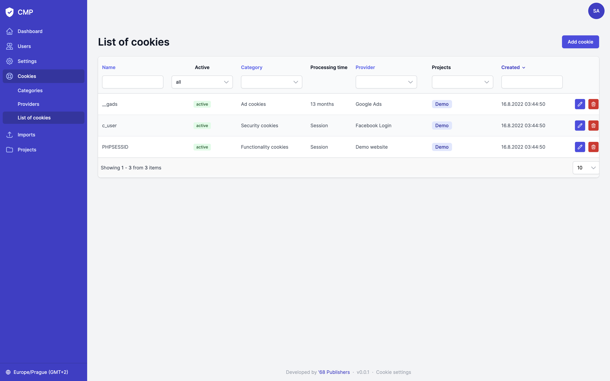
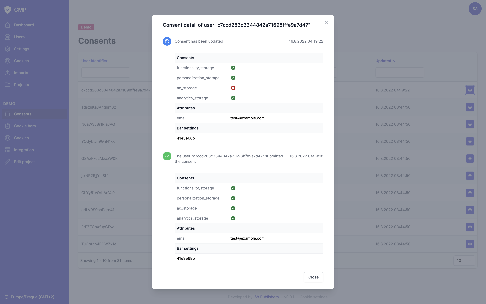

<div align="center" style="text-align: center; margin-bottom: 50px">

<h1 align="center">Product Documentation</h1>
</div>

<br>

## Table of Contents
* [Dashboard](#dashboard)
* [Users](#users)
* [Settings](#settings)
* [Cookies](#cookies)
  * [Categories](#categories)
  * [Providers](#providers)
  * [List of cookies](#list-of-cookies)
* [Imports](#imports)
* [Projects](#projects)
  * [Consents](#consents)
  * [Cookies bars](#cookie-bars)
  * [Project cookies](#project-cookies)
  * [Integration](#integration)

## Dashboard

The Dashboard contains statistics for all projects available to the logged-in user.
For each project, statistics are calculated for the selected period:


| Type             | Description                                                                                                                                               |
|------------------|-----------------------------------------------------------------------------------------------------------------------------------------------------------|
| Consents         | The number of unique consents (regardless of the positivity of the consent)                                                                               |
| Positivity       | The percentage of unique consents that are positive (not counting necessary categories)                                                                   |
| Consents (all)   | Total number of consents                                                                                                                                  |
| Positivity (all) | The percentage positivity of all consents (not including necessary categories)                                                                            |
| Providers        | The number of cookie providers                                                                                                                            |
| Cookies          | The number of cookies of the project, the first number are cookies bound to providers, the number in brackets are cookies defined directly on the project |
| Last consent     | Shows when the last consent was given (either positive or negative)                                                                                       |


## Users

Users log in with their email and password. Users cannot register themselves to the application, they must be added by an administrator.
The administrator can set a default password directly when creating a new user, or leave it blank and the user can choose own password using the "forgot password" functionality.
In addition, each user has assigned their projects that they can see and manage.

The application provides only two roles - `admin` and `manager` with following privileges:

| Resource/Active                                                   |      Manager       |       Admin        |
|-------------------------------------------------------------------|:------------------:|:------------------:|
| `Dashboard`                                                       |      Manager       |       Admin        |
| View statistics for projects that are visible by the current user | :white_check_mark: | :white_check_mark: |
| `User account`                                                    |      Manager       |       Admin        |
| Edit own data, change password                                    | :white_check_mark: | :white_check_mark: |
| `Users > Users`                                                   |      Manager       |       Admin        |
| View the list of users                                            |                    | :white_check_mark: |
| Create or edit a user                                             |                    | :white_check_mark: |
| Delete a user                                                     |                    | :white_check_mark: |
| `Users > New password requests`                                   |      Manager       |       Admin        |
| View the list of new password requests                            |                    | :white_check_mark: |
| `Settings`                                                        |      Manager       |       Admin        |
| View and edit the application settings                            |                    | :white_check_mark: |
| `Cookies > Categories`                                            |      Manager       |       Admin        |
| View the list of categories                                       |                    | :white_check_mark: |
| Create or edit a category                                         |                    | :white_check_mark: |
| Delete a category                                                 |                    | :white_check_mark: |
| `Cookies > Providers`                                             |      Manager       |       Admin        |
| View the list of providers                                        |                    | :white_check_mark: |
| Create or edit a provider                                         |                    | :white_check_mark: |
| Delete a provider                                                 |                    | :white_check_mark: |
| `Cookies > List of cookies`                                       |      Manager       |       Admin        |
| View the list of cookies                                          |                    | :white_check_mark: |
| Create or edit a cookie                                           |                    | :white_check_mark: |
| Delete a cookie                                                   |                    | :white_check_mark: |
| `Imports`                                                         |      Manager       |       Admin        |
| View the list of executed imports                                 |                    | :white_check_mark: |
| Run an import                                                     |                    | :white_check_mark: |
| `Projects`                                                        |      Manager       |       Admin        |
| View the list of projects that are visible by the current user    | :white_check_mark: | :white_check_mark: |
| Create a project                                                  |                    | :white_check_mark: |
| `Project > Consents`                                              |      Manager       |       Admin        |
| View the list of consents                                         | :white_check_mark: | :white_check_mark: |
| `Project > Cookie bars`                                           |      Manager       |       Admin        |
| View the list of cookie bars                                      | :white_check_mark: | :white_check_mark: |
| `Project > Cookies > Providers`                                   |      Manager       |       Admin        |
| View and edit project providers                                   | :white_check_mark: | :white_check_mark: |
| `Project > Cookies > Project cookies`                             |      Manager       |       Admin        |
| View the list of project cookies                                  | :white_check_mark: | :white_check_mark: |
| Create or edit a project cookie                                   | :white_check_mark: | :white_check_mark: |
| Delete a project cookie                                           | :white_check_mark: | :white_check_mark: |
| `Project > Integration`                                           |      Manager       |       Admin        |
| View and edit cookie table templates                              |                    | :white_check_mark: |
| View a cookie table integration code                              | :white_check_mark: | :white_check_mark: |
| `Project > Edit project`                                          |      Manager       |       Admin        |
| View and edit a project                                           |                    | :white_check_mark: |
| Delete a project                                                  |                    | :white_check_mark: |



## Settings

The application settings page now contains only the localization for entries. In the "Translation locales" field, select the locales you use on your site.
Cookies descriptions etc. will then be administered for the selected locales.

The default locale will be used if any record is missing a given translation.


## Cookies

Cookie management is based on the fact that we have defined categories and cookie providers.
Each provider is assigned its own cookies and the providers are then assigned to individual projects.


### Categories

Categories should be defined in the same way as you use them on your site. At least the same codes.
Be sure to mark the necessary category with the "Necessary category" flag.

The default installation will automatically create categories that are [defined by Google](https://policies.google.com/technologies/cookies?hl=en-US#types-of-cookies), but there is nothing stopping you from customizing them for your use.


### Providers

We could define providers as groups of cookies.

For example, we have Google Analytics deployed on our website. In this case, we will have a "Google Analytics" provider and this will contain cookies that are related to the service.

On a provider's edit page, we can manage also their cookies.

### List of cookies

Although cookies are managed through individual providers, we have listed all cookies here for clarity.



## Imports

Providers and cookies can be managed externally in CSV or JSON format or, for example, in an application such as Microsoft Excel or Google Sheets.
Then you only need to run an import and the data will be transferred to the application.

Here are examples of how the imported files should look like:

<details>
  <summary>Cookie providers import in CSV format</summary>

```csv
code|name|type|link|active|projects|purpose.cs|purpose.en
facebook_login|Facebook Login|3rd_party|https://www.facebook.com/about/privacy/|1|demo,test|"Platforma pro přihlášení skrze Facebook."|"Facebook login platform."
# ... more rows ...
```

</details>

<details>
  <summary>Cookie providers import in JSON format</summary>

```json5
[
  {
    "code": "facebook_login",
    "name": "Facebook login",
    "type": "3rd_party",
    "link": "https://www.facebook.com/about/privacy/",
    "active": true,
    "projects": [
      "demo",
      "test"
    ],
    "purpose": {
      "cs": "Platforma pro přihlášení skrze Facebook.",
      "en": "Facebook login platform."
    }
  }
  // ... more providers ...
]
```

</details>

- Allowed values for the field `type` are `1st_party` and `3rd_party`
- Projects in CSV must be comma separated list
- In CSV, each locale for `purpose` field must be separated column in the format `purpose.<LOCALE>`

<details>
  <summary>Cookies import in CSV format</summary>

```csv
name|category|provider|processingTime|active|purpose.cs|purpose.en
c_user|security_storage|facebook_login|session|1|"Facebook ID zákazníka."|"Customer\'s Facebook ID."
# ... more rows ...
```

</details>

<details>
  <summary>Cookies import in JSON format</summary>

```json5
[
  {
    "name": "c_user",
    "category": "security_storage",
    "provider": "facebook_login",
    "processingTime": "session",
    "active": true,
    "purpose": {
      "cs": "Facebook ID zákazníka.",
      "en": "Customer\'s Facebook ID."
    }
  }
  // ... more cookies ...
]
```

</details>

- The field `category` must contain a category code
- The field `provider` must contain a provider code
- Allowed values for the field `processingTime` are `"session"`, `"persistent"` or a duration string
- In CSV, each locale for `purpose` field must be separated column in the format `purpose.<LOCALE>`

If you want to import the main (1st party) provider, make sure that the project is already established. If the project doesn't exist, the provider will be created as a generic provider that can be assigned to any project.

So the correct procedure is to establish your projects first and then import the data.

## Projects

After selecting a specific project, the user is moved to the context of the selected project where he can see consents, cookie bar settings and manage project cookies.

### Consents

Here is the list of all recorded consents.
The consents are grouped according to the user identifier that the cookie bar creates and sends. After clicking on a detail, you can see the complete history of that user.



### Cookie bars

On this page you can find the settings of all cookie bars used.
The uniqueness of the cookie bar is determined by the checksum that is calculated and sent by the cookie bar itself.


### Project cookies

Here you can manage the main (1st party) provider that is only bound to the project whose context you are currently in.
Also, cookies that are only associated with the project are managed here.

### Integration

By integration, we mean the ability to easily render a table with providers, alternatively with cookies, directly on your website. For example, through a static page.

You can define a template that fits exactly into the design of your website and then render it by copying and pasting it into one of your pages.

We recommend leaving the creation of the template to the programmer, the template is written in the [Latte](https://latte.nette.org/) templating language and has two variables - `$providers` and `$cookies`.

Their values exactly copy the response from the endpoint `/api/{version}/cookies/{project}`. You can learn more about the API in the [Development Guide](development.md).


